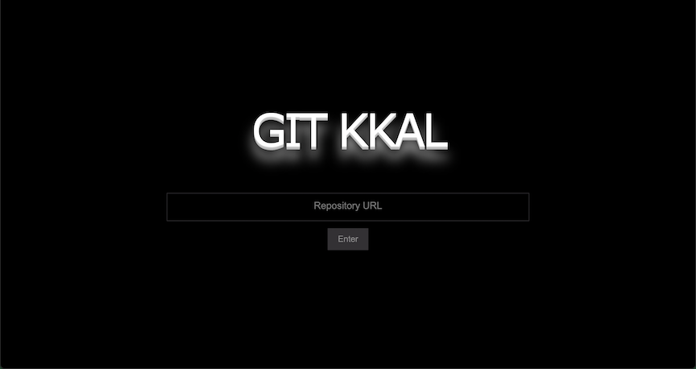

<h1 align="center">
  Git-Kkal
</h1>

<p align="center">
  
</p>

<p align="center">
  
  
  
  <a href="https://gitkkal.xyz" title="Netlify-deploy-status">
    
  </a>
</p>

<br/>

Git Kkal은 설치 없이 간편하게 이용할 수 있는 web git GUI viewer 입니다.

<br/>
<br/>

### 구동장면


<br/>
<br/>

## Index

  <ol>
    <li><a href="#motivation">Motivation</a></li>
    <li><a href="#tech-stack">Tech Stack</a></li>
    <li><a href="#task-tool">Task Tool</a></li>
    <li><a href="#role-and-responsibility">R&R</a></li>
    <li><a href="#schedule">Schedule</a></li>
    <li><a href="#convention">Convention</a></li>
    <li><a href="#features">Features</a></li>
    <li><a href="#ui-example">UI example</a></li>
    <li><a href="#demo">Demo</a></li>
    <li><a href="#installation">Installation</a></li>
    <li><a href="#usage">Usage</a></li>
  </ol>

<br/>
<br/>

## Motivation

Git의 tree 구조를 쉽게 이해하기 위해 graph를 시각화하여 보여주는 git GUI application 들을 시중에서 이미 찾아볼 수 있지만, application 설치를 선호하지 않는 사용자들 또는 자신의 PC가 아닌 PC를 사용하게 되는 경우 CLI로 git log를 확인해야 하는 번거로움이 있습니다.

그러한 불편함을 해소하기 위하여 간편하게 웹에서 git log를 확인할 수 있는 web application을 만들어보고자 이번 project를 기획하게 되었습니다.

<br/>
<br/>

## Tech Stack

Base  
`react`

Style  
`styled-component`

Graph render  
`pixi-js`, `three`

Convention Management  
`eslint`

Version Management  
`git`

Test case  
`mocha`, `cypress`

<br/>
<br/>

## Task Tool

- Scheduling: [Trello](https://trello.com/b/iKjkI4Ex/git-kkal/calendar-view)
- Mockup sketch: [Figma](https://www.figma.com/file/71oL7x9N5Jm7U1WGy0JJ9a/git-kkal?node-id=0%3A1)
- Information archiving: Notion

<br/>
<br/>

## Role and Responsibility

치원

- [KANBAN](https://trello.com/b/iKjkI4Ex/git-kkal/calendar-view) 제작 및 스케쥴 관리
- Team Convention setting
- Daily scrum log 작성
- get /repository api 구현
- Client Directory 구조 setting
- Repository page 구현
- Landing page UI
- Server & Client deploy
- Server & Client Test case 작성
- README 작성

선관

- Mock up 제작
- Server Directory 구조 setting
- get /repository/diff api 구현
- Diff page 제작
- 2D graph UI
- 3D graph UI

승현

- git log data로 graph 상 commit node의 위치를 계산할 수 있는 algorithm 구현
- 2D graph 구현
- 3D graph 구현

<br/>
<br/>

## Schedule

[KANBAN](https://trello.com/b/iKjkI4Ex/git-kkal/calendar-view)

개발기간 (09.30 ~ 10.17) 총 제작기간 19일

1주차 - 기획, POC

- 주제 선정
- [Mock up sketch 제작](https://www.figma.com/file/71oL7x9N5Jm7U1WGy0JJ9a/git-kkal?node-id=0%3A1)
- Spec check, scheduling
- Convention 협의
- Directory structure setting

2주차 - 구현

- Front
  - UI layout setting
  - Graph render algorithm 구현
  - Branch list, commit list, diff file list 출력 및 상호작
  - 2D graph 출력 및 click event 구현
- back
  - get /repository api, get /repository/diff api 구현
  - Error handling

3주차 - 마무리

- 3D graph 출력 및 click event 구현
- UI 개선작업
- Deploy
- Test case 작성
- Readme 작성
- 2D, 3D graph bug fix

<br/>
<br/>

## Convention

- Coding convetions: [airbnb](https://github.com/airbnb/javascript)
- [Commit message](https://github.com/helderburato/dotfiles/blob/main/git/.gittemplates/commit)
- CSS 선언 순서: NHN coding convention
- Branch 전략: Git-flow
- Merge 전략: Merge (create merge commit)

<br/>
<br/>

## Features

- Public repo 주소를 입력하여 commit log 확인
- 2D 및 3D graph 지원
- 변경된 파일을 클릭하여 변경사항 확인 가능

<br/>
<br/>

## UI example

### Landing Page



<br/>

### Repository page


<br/>

### 3d Graph


<br/>

### Diff Page


<br/>
<br/>

## Demo

[Demo Link](https://gitkkal.xyz)

### Client

- Netlify를 이용하여 애플리케이션 배포 및 관리

### Server

- AWS Elastic Beanstalk를 사용하여 애플리케이션 배포 및 관리
- Amazon ACM (AWS Certificate Manager)을 사용한 SSL 관리 (HTTPS protocol)
  <br/>
  <br/>

## Installation

- FANTASY BASEBALL은 서버가 배포된 사이트입니다.
- 로컬에서 구동을 원하신 경우 아래와 같이 `.env` 파일 설정이 필요합니다.

### env 설정

1. Frontend

```shell
REACT_APP_SERVER_URL=http://localhost:8000
```

2. Backend

```shell
PORT=8000
DEBUG=*:*
CLIENT_URL=http://localhost:3000
```

<br/>
<br/>

## Usage

1. Landing Page에서 public repo URL 입력
2. Branch, commit node, commit message 를 클릭하여 diff 를 확인하고자 하는 commit을 변경
3. 2D, 3D 버튼으로 2D Graph-3D Graph 간 전환
4. Diff file name을 클릭하여 해당 Diff page로 이동

<br/>
<br/>

## Challenge

1. git graph rendering algorithm

   - challenge factor
     - git log data를 기반으로, CLI git log --graph 또는 Source tree 에서 보이는 그래프 형태를 구현해야 했음
   - 구현 원리 1. commit graph는 commit 의 parent를 기준으로 만든 tree 구조 2. algorithm 실행시 먼저 parent가 없는 commit들을 찾아 해당 브랜치의 최상위 commit을 파악 3. git log를 탐색하며 node의 포지션 data를 만들어냄 4. parent 는 최대 2개 까지 가질 수있으며, parent의 갯수로 해당 commit의 종류를 파악할 수 있음(merge commit, 새로 시작된 branch, 단순 commit)

2. 2D graph rendering
   - 문제점
     - 하나의 canvas 위에 그려낼 수 있는 pixel 수에 제한이 있으므로 git log가 많은 repository를 render할 경우 비정상적 render 발생
   - 해결책
     - git log 의 개수를 제한하여 render

<br/>
<br/>

## 개인별 느낀점(아쉬운점)

### 공통

상태관리 라이브러리 도입

- Spec check 당시 가변적인 state가 없을 것으로 예측하였으나, 개발 진행 도중 예상외로 관리가 필요한 state의 존재를 알게되었다. schedule 준수를 위해 상태관리 라이브러리를 도입하지 않고 진행하였으나, prop drilling이 반복되며 개발속도와 코드의 가독성을 저하시켰다.

### 치원

ShellJs (Node.js Unix shell command library)

- Spec check 당시 CLI command 를 직접적으로 사용할 수 있는 library의 존재를 알았다면, git graph render algorithm을 보다 쉽게 구현할 수 있었을 것이고, 추가 기능 개발에 투자할 수 있는 시간을 확보할 수 있었을 것으로 예상한다.

### 선관

1. 3d graph 선 두께 조절

   - 문제점
     - three js 에서 선을 두껍게 하는 옵션이 동작하지 않음.
     - WebGL 렌더러를 사용하는 OpenGL Core Profile 의 제한으로 인해 선의 두께는 항상 1로 고정됨
   - 해결을 위하여 시도한 방법

     1. 선을 원통형으로 돌려 두꺼워보이는 효과를 냄
        - 선을 입체로 render하는 logic이 필요하나, 스케쥴 준수를 우선 두께를 조정하지 않고 진행
     2. 관련 Library 도입
        - 최소한의 Library만 사용하고자, 관련 library는 사용하지 않음

2. Local file에 접근할 수 있는 [web API](https://developer.mozilla.org/en-US/docs/Web/API/FileSystemWritableFileStream)의 존재

   - Spec check 때 알았더라면 시중에 나와있는 Source tree 또는 Git Kraken과 같은 git add, commit, push, pull 등의 기능을 추가해볼 수 있었을 것으로 예상

3. 구체적인 mockup 제작
   - Mockup 을 섬세하게 설계하지 못해 지속적으로 변경되는 부분이 나오게 되어, 불필요한 시간모소를 하게됨

### 승현

1. graph rendering algorithm

   - 충분하지 못한 algorithm 검증으로 edge case가 발생하였고, 수정을 위하여 schedule에 없던 시간을 소모하게 됨

2. WebGL library 선택

   - three-fiber가 아닌 일반 three library를 사용하는 것이 관련자료를 찾기에 용이하여 구현에 보다 용이하였을 것으로 예상

<br/>

## Future plan(차후 구현예정 or 수정예정기능)

### 치원

State management library

- redux, mobx와 같은 상태관리 라이브러리 도입

### 선관

Code Mirror

- Code highlighting 및 간단하게 수정하고 push 할 수 있는 editor기능

### 승현

1. Three clean up

   - Three 로 rendering을 위해 생성해둔 객체들을 clean up 되지 않고 있음
   - dispose 가능한 방법을 찾아 해결 예정

2. Algorithm refactor

   - refactor을 통하여 graph rendering algorith의 시간복잡도 개선(현재 logic상 시간복잡도는 O(n^2)

3. Large repository

   - 표현해야되는 git log의 양이 1개의 canvas를 초과할 경우, 다수의 canvas에 commit log를 나눠서 render
